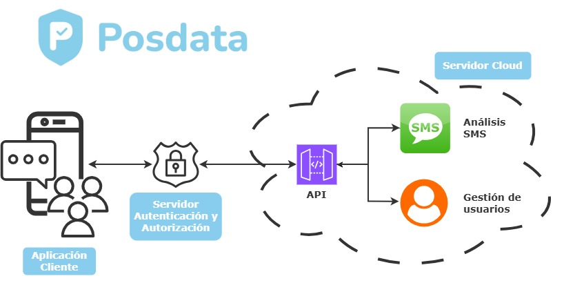

# Posdata — SMishing Detection Platform for Older Adults

Posdata is a proof-of-concept SMishing detection platform designed to protect older adults from SMS-based phishing attacks. It combines a serverless cloud backend deployed on AWS, a local authentication server, and an Android client application, providing automatic SMS interception, AI-powered fraud analysis, and accessible verdict notifications tailored to senior users.

> This project was developed as a Final Degree Project (TFG) in the context of the growing threat of digital fraud targeting elderly people, a vulnerable and often overlooked demographic in the design of cybersecurity systems.

---

## Architecture



The system is structured around three main components:

- **AWS Serverless Backend**: Orchestrates SMS analysis through a Step Functions state machine, invoking a deterministic list-based classifier and a probabilistic AI classifier sequentially, followed by a notification module.
- **Local Authentication Server**: A Node.js server managing user credentials, token consumption and access control, decoupled from the cloud processing layer on a private MySQL database.
- **Android Client App**: A fully accessible, highly configurable Android application that intercepts incoming SMS messages, submits them for analysis, and displays verdict notifications adapted to the user's personal preferences.

---

## Repository Structure

```
TFG_POSDATA/
├── backend/
│   ├── aws/
│   │   ├── api/                        # API Gateway route definitions (SMS + Users)
│   │   ├── layers/posdata-utils-layer/ # Shared Lambda utility layer
│   │   ├── permissions/                # IAM roles and policies
│   │   └── scripts/
│   │       ├── detection/              # Lambda handlers: AI check, lists check, hash learning
│   │       ├── notification/           # Lambda handler: notify results
│   │       └── users/                  # Lambda handlers: user management
│   └── colab/
│       ├── models/                     # Trained model files (distilbert_v1, lgbm_v1, meta_v1)
│       ├── scripts/datasets/           # Training datasets
│       ├── dataset_exploration.ipynb   # Dataset analysis and visualization
│       ├── deployment.ipynb            # Model export and deployment packaging
│       ├── feature_extraction_layer.ipynb      # LightGBM feature extraction development
│       ├── linguistic_prediction_layer.ipynb   # DistilBERT fine-tuning
│       └── metaclassifier.ipynb        # Meta-classifier training and evaluation
├── diagrams/                           # Architecture and flow diagrams
├── frontend/PosdataApp/                # Android client application (Kotlin + Jetpack Compose)
├── localserver/                        # Node.js local authentication server
├── LICENSE
├── Posdata_Manual.pdf                  # Accessible user manual for seniors and families
└── README.md
```

---

## Getting Started

### Prerequisites

- **Android Studio**: To build and emulate the Android client
- **XAMPP**: To run the local authentication server database
- **AWS Account**: The backend is fully deployed on AWS (EU Paris region). Lambda functions, Step Functions, DynamoDB tables, S3 buckets, API Gateway, SQS, SNS and SES are all required services.
- **Node.js**: To run the local server

### Local Server Setup

1. Start XAMPP and ensure Apache and MySQL are running.
2. Create a database named `posdata_db` with a `users` table containing the following fields:

| Field | Type |
|-------|------|
| `id` | INT (PK, AUTO_INCREMENT) |
| `user_id` | VARCHAR |
| `email` | VARCHAR |
| `password_hash` | VARCHAR |
| `tokens` | INT |
| `created_at` | TIMESTAMP |

3. Navigate to the `localserver/` directory and install dependencies:
```bash
npm install
```
4. Start the server:
```bash
node server.js
```

### Android App Setup

1. Open `frontend/PosdataApp/` in Android Studio.
2. Create a `local.env` file in the project assets folder (if not already present) and add the following:
```
API_KEY=your_posdata_api_key
CLOUD_API_URL=https://your-aws-api-gateway-url/
LOCAL_API_URL=http://your-local-server-url/
```
3. Build and run the project on an Android emulator (API level 26 or higher recommended).

> The app is designed to be used with an emulator. SMS interception is tested via Android Studio's emulator SMS injection tool.

---

## AI Classification Layer

The probabilistic detection layer is built on a hybrid ensemble model trained on a bilingual (English/Spanish) SMS dataset:

- **LightGBM** — heuristic feature-based classifier (structural, semantic and content features)
- **DistilBERT** (multilingual, fine-tuned) — NLP-based classifier exported to ONNX for Lambda deployment
- **Logistic Regression Meta-classifier** — combines probability scores from both models to produce a final verdict

Training notebooks are available under `backend/colab/`. Trained model files are stored under `backend/colab/models/` and deployed to an S3 bucket accessed by the AI Lambda at runtime.

| Model | Accuracy | F1 (spam) |
|-------|----------|-----------|
| LightGBM | 0.96 | 0.90 |
| DistilBERT | 0.98 | 0.95 |
| Meta-classifier | 0.98 | 0.96 |

---

## User Manual

A physical-style accessible user manual for seniors and families is available at the root of the repository: [`Posdata_Manual.pdf`](Posdata_Manual.pdf). It covers platform setup, key features, and phishing awareness content tailored to older adults.

---

## License

See [`LICENSE`](LICENSE) for details.

---

## About

Posdata was designed and developed by a Computer Science student as a Final Degree Project, motivated by the real and growing risk of SMS phishing fraud among older adults. The system addresses not only technical detection accuracy but also accessibility, explainability, and the specific cognitive and social needs of its target users.
